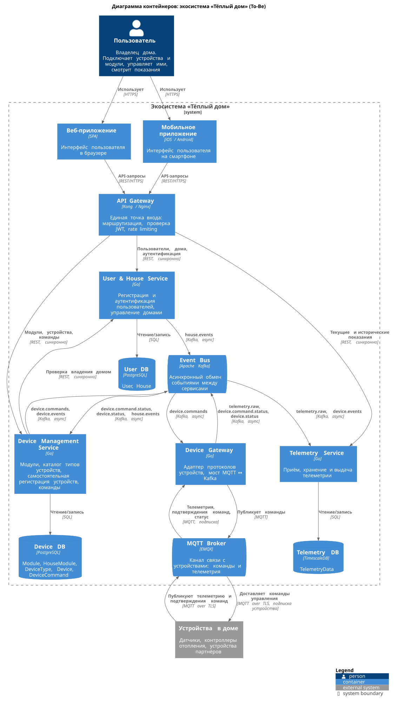
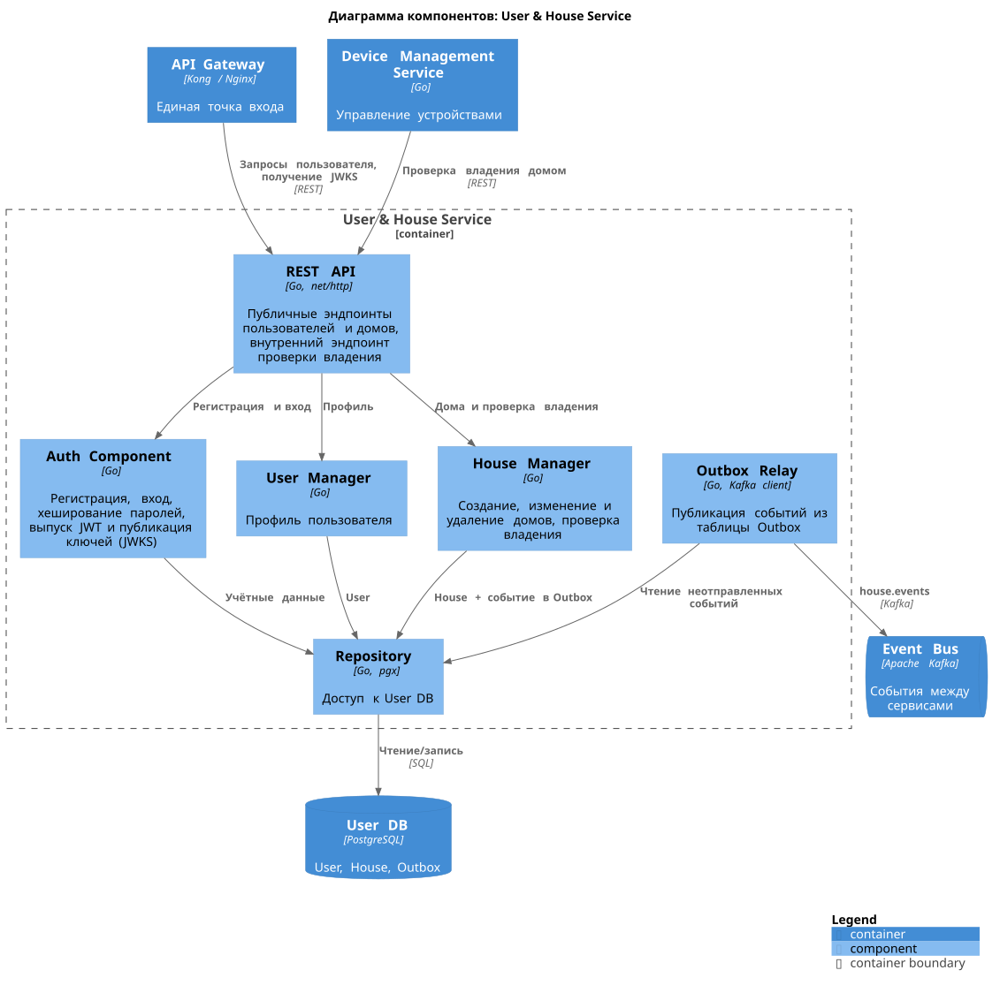
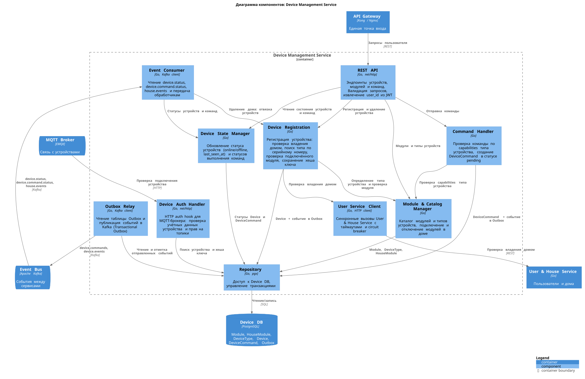
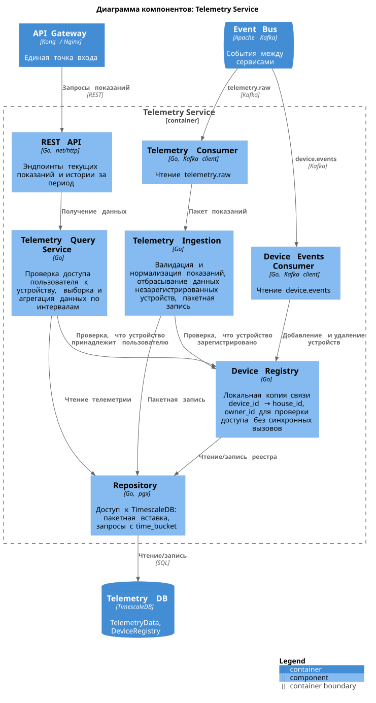
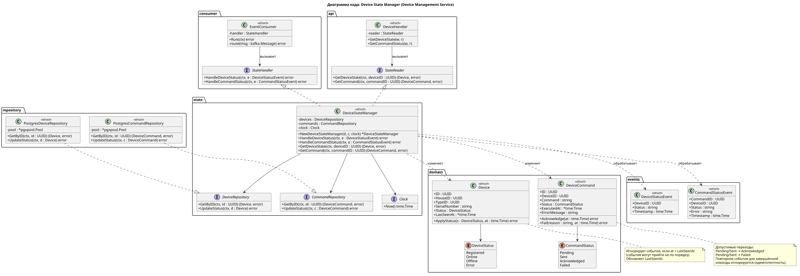

# Project_template

Это шаблон для решения проектной работы. Структура этого файла повторяет структуру заданий. Заполняйте его по мере работы над решением.

# Задание 1. Анализ и планирование

<aside>

Чтобы составить документ с описанием текущей архитектуры приложения, можно часть информации взять из описания компании и условия задания. Это нормально.

</aside

### 1. Описание функциональности монолитного приложения

**Управление отоплением:**

- Пользователи могут удалённо включать/выключать отопление в своих домах.
- Система отправляет команду на включение/выключение реле

**Мониторинг температуры:**

- Пользователи могут просматривать текущую температуру в своих домах через веб-интерфейс.
- Система получает данные о температуре с датчиков, установленных в домах.
### 2. Анализ архитектуры монолитного приложения

- Язык программирования: Go
- База данных: PostgreSQL
- Архитектура: Монолитная, все компоненты системы (обработка запросов, бизнес-логика, работа с данными) находятся в рамках одного приложения.
- Взаимодействие: Синхронное, запросы обрабатываются последовательно.

### 3. Определение доменов и границы контекстов

- Пользователи и дома. Кто владеет каким домом и какими устройствами.
- Управление устройствами. Подключение устройства (Сейчас необходим выезд специалиста для подключения). Отправка команд, хранение состояния реле отопления.
- Телеметрия. Получение и хранение показаний устройств.

### **4. Проблемы монолитного решения**

- Масштабируемость: Ограничена, так как монолит сложно масштабировать по частям.
- Отказоустойчивость: Сбой в одном модуле влияет на всю систему.
- Команды не могут независимо разрабатывать и развертывать изменения.
- Развертывание: Требует остановки всего приложения.
- Синхронный опрос датчиков. Серверу нужно самому обращаться к каждому датчику. Если датчик медленный или недоступен, запрос зависает по таймауту и занимает ресурсы.
- Отсутствие сервиса самостоятельного подключения устройств. Требует выезда специалиста на каждую установку.

### 5. Визуализация контекста системы — диаграмма С4

# Задание 2. Проектирование микросервисной архитектуры

**Диаграмма контейнеров (Containers)**

**Диаграмма компонентов (Components)**

**Диаграмма кода (Code)**

# Задание 3. Разработка ER-диаграммы

# Задание 4. Создание и документирование API

### 1. Тип API

Укажите, какой тип API вы будете использовать для взаимодействия микросервисов. Объясните своё решение.

### 2. Документация API

Здесь приложите ссылки на документацию API для микросервисов, которые вы спроектировали в первой части проектной работы. Для документирования используйте Swagger/OpenAPI или AsyncAPI.

[openapi Device service](docs/api/openapi/device-management.openapi.yaml)
[openapi Telemetry service](docs/api/openapi/telemetry.openapi.yaml)
[asyncapi Events](docs/api/asyncapi/events.asyncapi.yaml)

# Задание 5. Работа с docker и docker-compose

1) temperature-api приложение на Go, которое при запросе /temperature?location= отдает рандомное значение температуры.

2) Приложение упаковано в Docker и добавлено в docker-compose. Порт по умолчанию 8081

3) в docker-compose добавлены настройки для запуска postgres с указанием скрипта инициализации ./smart_home/init.sql

При выполнении работы на всех этапах использовался ИИ. В первую очередь как наставник, чтобы быстро получить ответы на вопросы.